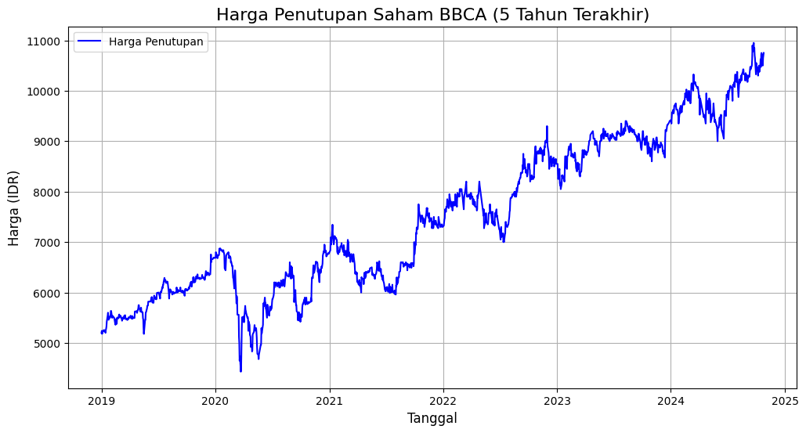
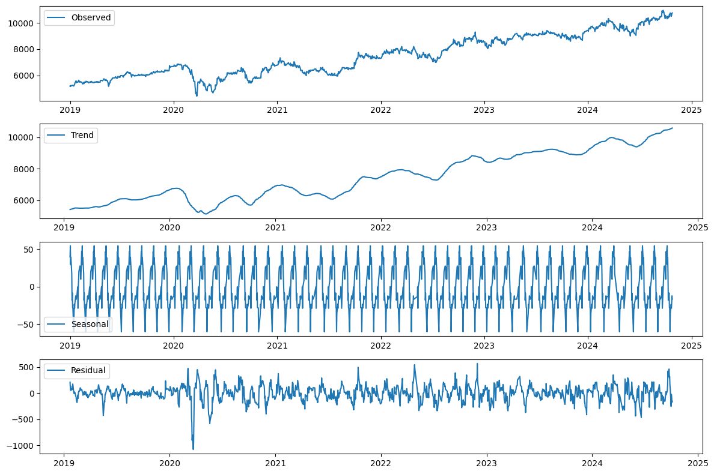

# Laporan Proyek Machine Learning - Gerin Sena Pratama

## Domain Proyek

Pada saat ini, pasar saham menjadi salah satu area yang sangat diperhatikan oleh banyak investor dan trader. Prediksi harga saham yang akurat dapat memberikan keuntungan yang signifikan. Dalam proyek ini, kami fokus pada prediksi harga penutupan saham BCA (Bank Central Asia) menggunakan algoritma time series, yaitu LSTM (Long Short-Term Memory) dan ARIMA (AutoRegressive Integrated Moving Average).

Permasalahan yang dihadapi adalah ketidakpastian dalam pergerakan harga saham, yang dapat dipengaruhi oleh berbagai faktor ekonomi, sosial, dan politik. Oleh karena itu, model yang dapat memprediksi harga saham secara akurat sangat diperlukan. Berdasarkan penelitian sebelumnya, model ARIMA lebih sederhana dan mudah dipahami, namun kurang mampu menangani pola kompleks. Sebaliknya, model LSTM lebih kompleks dan memerlukan data yang lebih banyak, tetapi lebih baik dalam menangani pola yang rumit dan sulit diprediksi (Milniadi & Adiwijaya, 2022).

Referensi:
Milniadi, A. D., & Adiwijaya, N. O. (2022). Analisis Perbandingan Model ARIMA dan LSTM dalam Peramalan Harga Penutupan Saham (Studi Kasus: 6 Kriteria Kategori Saham Menurut Peter Lynch). Universitas Jember.

## Business Understanding

### Problem Statements

1. **Pernyataan Masalah 1:** Bagaimana cara memprediksi harga saham BCA secara akurat menggunakan data historis?
2. **Pernyataan Masalah 2:** Model mana yang lebih efektif antara LSTM dan ARIMA dalam memprediksi harga saham?

### Goals

- **Jawaban pernyataan masalah 1:** Mengembangkan model prediksi harga saham BCA yang dapat memberikan estimasi yang akurat berdasarkan data historis.
- **Jawaban pernyataan masalah 2:** Membandingkan performa model LSTM dan ARIMA untuk menentukan model yang lebih baik dalam memprediksi harga saham BCA.

### Solution Statements

1. Menggunakan model LSTM untuk menangkap pola non-linear dalam data harga saham BCA.
2. Menggunakan model ARIMA sebagai baseline untuk perbandingan dengan model LSTM, serta melakukan hyperparameter tuning untuk meningkatkan performa.

## Data Understanding

Data yang digunakan dalam proyek ini diambil dari Kaggle, yang berisi harga saham BCA selama periode tertentu. Dataset dapat diunduh melalui tautan berikut: [Dataset Harga Saham BCA](https://www.kaggle.com/datasets/caesarmario/bank-central-asia-stock-historical-price).

### Informasi Data
- **Jumlah Data:** Dataset ini memiliki 1426 baris dan 6 kolom.
- **Duplicate Values:** Dataset ini mengandung 6 baris duplikat.
- **Missing Values:** Tidak terdapat missing values pada dataset, artinya semua kolom memiliki nilai lengkap untuk setiap baris.
- **Outliers:** Teridentifikasi 73 outliers pada kolom `Volume` berdasarkan metode Interquartile Range (IQR). Tidak ada outliers yang ditemukan pada kolom `Open`, `High`, `Low`, `Close`, dan `Adj Close`.

### Variabel-variabel dalam dataset adalah sebagai berikut:

- **Date:** Tanggal pencatatan harga saham.
- **Open:** Harga pembukaan saham pada hari tersebut.
- **High:** Harga tertinggi saham yang tercatat pada hari tersebut.
- **Low:** Harga terendah saham yang tercatat pada hari tersebut.
- **Close:** Harga penutupan saham pada hari tersebut.
- **Adj Close:** Harga penutupan saham yang telah disesuaikan untuk faktor-faktor seperti dividen, stock split, dan rights issue, memberikan nilai yang lebih akurat untuk analisis historis dan perhitungan return investasi.
- **Volume:** Jumlah saham yang diperdagangkan pada hari tersebut.


### Exploratory Data Analysis (EDA)

Berikut adalah beberapa tahapan **Exploratory Data Analysis (EDA)** yang digunakan untuk memahami data harga saham secara lebih mendalam.

#### 1. Melihat Struktur Data dengan `data.head()` dan `data.info()`

- **`data.head()`**: Digunakan untuk menampilkan lima baris pertama dari dataset. Ini membantu kita mengenal struktur kolom, tipe data, dan memastikan tidak ada nilai yang tampak aneh.
- **`data.info()`**: Memberikan ringkasan tentang dataset, mencakup tipe data setiap kolom, jumlah nilai non-null, dan ukuran dataset. Ini berguna untuk memeriksa apakah ada kolom dengan nilai kosong atau tipe data yang perlu diubah.

#### 2. Visualisasi Harga Penutupan Saham (`Close`)

Visualisasi harga penutupan saham membantu kita memahami pergerakan harga dari waktu ke waktu. Pada grafik garis, kita dapat melihat pola kenaikan dan penurunan harga saham, mendeteksi tren, dan mengidentifikasi periode volatilitas tinggi atau rendah.



#### 3. Analisis Komponen Musiman dengan `seasonal_decompose`

Dekomposisi data time series menggunakan metode `seasonal_decompose` memisahkan data menjadi empat komponen utama:
   - **Observed**: Data asli, yaitu harga penutupan saham (`Close`).
   - **Trend**: Pola naik atau turun jangka panjang dalam data.
   - **Seasonal**: Pola yang berulang dalam periode tertentu.
   - **Residual**: Fluktuasi acak yang tidak dapat dijelaskan oleh trend atau pola musiman.

Dekomposisi ini membantu kita memahami komponen utama dalam data yang dapat memberikan insight mengenai pola musiman dan tren jangka panjang.

#### Visualisasi Dekomposisi Data Time Series

Berikut adalah visualisasi dari masing-masing komponen:

- **Observed**: Menampilkan data harga penutupan asli.
- **Trend**: Menunjukkan kecenderungan jangka panjang pada harga saham.
- **Seasonal**: Menunjukkan pola berulang dalam harga saham berdasarkan periode tertentu.
- **Residual**: Menunjukkan fluktuasi acak atau kebisingan dalam data.



Dengan melakukan analisis dekomposisi ini, kita dapat melihat komponen yang membentuk pola harga saham, termasuk tren yang mungkin tersembunyi dalam data asli serta pola musiman yang konsisten. Ini memberikan pemahaman yang lebih mendalam dan membantu mempersiapkan data untuk analisis prediksi lebih lanjut.

## Data Preparation

Pada bagian ini, dilakukan beberapa langkah untuk mempersiapkan data agar siap digunakan dalam model prediksi. Setiap langkah dipilih dengan alasan tertentu untuk meningkatkan kualitas data. Berikut tahapan yang dilakukan:

### 1. Memuat Data dari CSV

Data diambil dari file CSV dan diubah menjadi DataFrame. Kolom `Date` dijadikan sebagai indeks dengan tipe tanggal untuk representasi time series.

```python
data = pd.read_csv(output, index_col="Date", parse_dates=True)
```

Penjelasan:

- Menetapkan kolom Date sebagai indeks memudahkan akses berbasis waktu, yang sangat penting dalam analisis time series.

### 2. Memilih Kolom Close Saja
Kita hanya menggunakan kolom Close sebagai target untuk prediksi harga saham.

```python
data = data[['Close']]
```
Alasan:
- Kolom Close digunakan karena mencerminkan harga penutupan harian, yang umum dijadikan acuan utama dalam analisis dan prediksi harga saham.

### 3. Menyusun Data dengan Frekuensi Harian dan Interpolasi

```python
data = data.asfreq(freq='D')
data.interpolate(inplace=True)
```
Penjelasan:
- Penyesuaian frekuensi harian ('D') dan interpolasi digunakan agar data menjadi konsisten dalam interval waktu harian, sekaligus mengisi kekosongan data yang bisa mengganggu analisis.

### 4. Pembagian Data menjadi Train dan Test Set
Data dibagi menjadi dua bagian, yaitu train (80%) dan test (20%), untuk melatih dan menguji model.

### 5. Normalisasi Data
Data dinormalisasi menggunakan metode MinMaxScaler ke dalam rentang -1 hingga 0 untuk mempercepat dan menstabilkan proses pelatihan model.
```python
dataset = data.values
scaler = MinMaxScaler(feature_range=(-1, 0))
data_scaled = scaler.fit_transform(dataset)
```

### 6. Membuat Dataset dengan Window 60 Hari
Dengan windowing, data dipecah menjadi beberapa subset untuk menangkap pola dalam interval waktu 60 hari.

```python
time_step = 60
train_data, test_data = data_scaled[:train_size-time_step,:], data_scaled[train_size-time_step:,:]

def create_dataset(dataset, time_step=1):
    X, Y = [], []
    for i in range(len(dataset) - time_step - 1):
        a = dataset[i:(i + time_step), 0]  
        X.append(a)
        Y.append(dataset[i + time_step, 0]) 
    return np.array(X), np.array(Y)

x_train, y_train = create_dataset(train_data, time_step)
x_test, y_test = create_dataset(test_data, time_step)
```

### 7. Reshape Data
Data di-reshape ke bentuk [samples, time steps, features] agar kompatibel dengan model LSTM.

```python
x_train = np.reshape(x_train, (x_train.shape[0], x_train.shape[1], 1))
x_test = np.reshape(x_test, (x_test.shape[0], x_test.shape[1], 1))
```
Penjelasan:
- Reshape data sangat penting agar struktur data cocok dengan model LSTM yang membutuhkan input dalam bentuk tiga dimensi.

Proses ini diperlukan untuk memastikan model dapat belajar dengan baik tanpa terganggu oleh data yang tidak relevan atau tidak akurat.

## Modeling

Pada tahap ini, model Long Short-Term Memory (LSTM) dan AutoRegressive Integrated Moving Average (ARIMA) digunakan untuk memprediksi harga penutupan saham BCA. Berikut adalah penjelasan lebih detail mengenai proses pemodelan dan cara kerja masing-masing algoritma pada data harga penutupan saham.

### 1. Model LSTM

#### Tahapan dan Cara Kerja LSTM untuk Prediksi Harga Penutupan Saham
1. **Inisialisasi Model:** Untuk memastikan tidak ada pengaruh dari cache atau model sebelumnya, sesi dibersihkan terlebih dahulu menggunakan `tf.keras.backend.clear_session()`.
2. **Arsitektur Model:** Model dibangun menggunakan dua lapisan LSTM. Lapisan pertama memiliki 50 unit neuron dan `return_sequences=True`, sehingga memungkinkan model menangkap pola sekuensial yang kemudian dilanjutkan ke lapisan LSTM berikutnya. Lapisan kedua juga memiliki 50 neuron untuk membantu menangkap pola jangka panjang dari data time series.
3. **Lapisan Output:** Setelah dua lapisan LSTM, ditambahkan lapisan `Dense` dengan satu neuron. Lapisan ini bertanggung jawab untuk menghasilkan prediksi harga penutupan saham BCA pada hari berikutnya berdasarkan pola data sebelumnya.
4. **Kompilasi Model:** Model dikompilasi menggunakan optimizer `Adam`, yang dikenal baik dalam memperbarui bobot secara efisien dalam neural network. Fungsi loss `mean_squared_error` digunakan karena mengukur kesalahan prediksi secara kuadrat, sesuai untuk prediksi nilai numerik seperti harga saham.
5. **Early Stopping:** Early stopping diterapkan untuk menghentikan pelatihan jika tidak ada perbaikan pada validasi loss dalam 10 epoch berturut-turut. Ini menghindari overfitting, di mana model terlalu terlatih pada data training sehingga kurang mampu generalisasi pada data baru.
6. **Pelatihan Model:** Pelatihan dilakukan dengan `epochs=100` dan `batch_size=32`, untuk memberikan cukup waktu bagi model mempelajari pola harga penutupan saham BCA tanpa memicu overfitting.

#### Cara Kerja LSTM pada Data Harga Penutupan Saham
LSTM merupakan jenis Recurrent Neural Network (RNN) yang dirancang untuk mengenali dependensi jangka panjang dalam data time series. Dengan memori internal, LSTM "mengingat" informasi penting dari hari-hari sebelumnya yang relevan untuk prediksi hari selanjutnya. Untuk harga penutupan saham, LSTM mampu menangkap pola historis dan potensi tren di masa depan, sehingga memberikan prediksi yang lebih sesuai untuk data dengan volatilitas tinggi seperti saham.

### 2. Model ARIMA

#### Tahapan dan Cara Kerja ARIMA untuk Prediksi Harga Penutupan Saham
1. **Pembagian Data:** Data harga penutupan saham BCA dibagi menjadi 80% untuk training dan 20% untuk testing. Hal ini memungkinkan model dilatih pada data historis dan diuji pada data yang belum terlihat.
2. **Penentuan Parameter (p, d, q):** ARIMA menggunakan tiga parameter penting:
   - `p` (autoregessive): Banyaknya observasi sebelumnya yang digunakan untuk memprediksi nilai saat ini.
   - `d` (difference): Tingkat diferensiasi yang diterapkan untuk membuat data menjadi stasioner. Diferensiasi kedua (`d=2`) diterapkan karena data harga saham umumnya memiliki tren yang perlu dinormalisasi agar stabil.
   - `q` (moving average): Rata-rata dari kesalahan prediksi di masa lalu yang digunakan untuk memprediksi nilai saat ini.
3. **Pelatihan Model:** Setelah pembagian data dan penentuan parameter `(1, 2, 1)`, model dilatih pada data training untuk menangkap pola linier dalam harga penutupan saham BCA. Model ARIMA mengkombinasikan elemen autoregressive dan moving average untuk menangkap pola dalam data.

#### Cara Kerja ARIMA pada Data Harga Penutupan Saham
ARIMA adalah metode statistik yang sesuai untuk data yang memiliki tren linier dan dapat dijadikan stasioner. Model ini menggunakan observasi masa lalu dari harga penutupan untuk membuat prediksi masa depan. ARIMA bekerja dengan baik untuk pola sederhana, tetapi sering kali kurang efektif untuk pola musiman yang kompleks atau data volatil seperti saham, terutama jika dibandingkan dengan LSTM.

## Evaluation

Metrik evaluasi yang digunakan dalam proyek ini adalah RMSE (Root Mean Square Error), MAPE (Mean Absolute Percentage Error), dan R² (Koefisien Determinasi).

### Hasil Evaluasi

- **LSTM:**
  - RMSE: 114.0646
  - MAPE: 0.89%
  - R²: 0.9569

- **ARIMA:**
  - RMSE: 353.8909
  - MAPE: 3.05%
  - R²: 0.5882

Hasil di atas menunjukkan bahwa model LSTM memiliki performa yang lebih baik dibandingkan dengan ARIMA dalam memprediksi harga saham BCA. Dengan RMSE yang lebih rendah, MAPE yang lebih baik, dan nilai R² yang lebih tinggi, LSTM dapat menangkap pola pergerakan harga saham dengan lebih akurat.

### Penjelasan Formula Metrik

#### 1. RMSE (Root Mean Squared Error)

**Formula:**

$$
\text{RMSE}(y, \hat{y}) = \sqrt{\frac{\sum_{i=1}^{N} (y_i - \hat{y}_i)^2}{N}}
$$

**Penjelasan:**
- **$y$**: Nilai aktual (observasi nyata).
- **$ŷ$**: Nilai prediksi dari model.
- **$N$**: Jumlah data.
- **$(y_i - ŷ_i)$**: Selisih antara nilai aktual dan prediksi pada titik ke-i.
- **$(y_i - ŷ_i)²$**: Kuadrat dari selisih tersebut, untuk memastikan bahwa error negatif dan positif dihitung sebagai kesalahan.
- **$Σ (y_i - ŷ_i)²$**: Penjumlahan dari semua kuadrat kesalahan.
- **$N$**: Pembagi untuk mendapatkan rata-rata kesalahan kuadrat per data.
- **$√$**: Akar kuadrat untuk mengembalikan kesalahan ke skala aslinya.

**Cara Kerja:**
RMSE mengukur seberapa besar perbedaan antara nilai yang diprediksi oleh model dan nilai sebenarnya. Metrik ini memberikan penekanan pada kesalahan yang lebih besar, karena kesalahan yang lebih besar diberi bobot lebih besar (karena kuadrat). Nilai RMSE yang lebih kecil menunjukkan prediksi yang lebih akurat.

---

#### 2. MAPE (Mean Absolute Percentage Error)

**Formula:**

$$
\text{MAPE} = \frac{1}{N} \sum_{i=1}^{N} \left|\frac{y_i - \hat{y}_i}{y_i}\right| \times 100
$$

**Penjelasan:**
- **$y$**: Nilai aktual (observasi nyata).
- **$ŷ$**: Nilai prediksi dari model.
- **$N$**: Jumlah data.
- **$|y_i - ŷ_i|$**: Nilai absolut dari perbedaan antara nilai aktual dan nilai prediksi.
- **$(y_i)$**: Nilai aktual pada titik ke-i.
- **$× 100$**: Menghitung persentase kesalahan.

**Cara Kerja:**
MAPE menghitung rata-rata persentase kesalahan antara nilai aktual dan prediksi. MAPE sangat berguna karena memberikan ukuran kesalahan dalam bentuk persentase, yang lebih mudah dipahami dan dibandingkan di antara berbagai model atau dataset. Nilai MAPE yang lebih kecil menunjukkan model yang lebih akurat. Namun, MAPE dapat memiliki masalah jika nilai aktual mendekati nol, karena bisa menghasilkan nilai kesalahan yang sangat besar.

---

#### 3. R² (Coefficient of Determination)

**Formula:**

$$
R^2 = 1 - \frac{\sum_{i=1}^{N} (y_i - \hat{y}_i)^2}{\sum_{i=1}^{N} (y_i - \bar{y})^2}
$$

**Penjelasan:**
- **$y$**: Nilai aktual.
- **$ŷ$**: Nilai prediksi dari model.
- **$N$**: Jumlah data.
- **$\bar{y}$**: Rata-rata nilai aktual (mean).
- **$(y_i - ŷ_i)²$**: Kuadrat dari selisih antara nilai aktual dan prediksi.
- **$(y_i - \bar{y})²$**: Kuadrat dari selisih antara nilai aktual dan rata-rata nilai aktual.

**Cara Kerja:**
R² mengukur seberapa baik model dapat menjelaskan variasi dalam data. Nilai R² berkisar antara 0 hingga 1:
- Nilai R² yang mendekati **1** menunjukkan bahwa model dapat menjelaskan sebagian besar variasi dalam data.
- Nilai R² yang mendekati **0** menunjukkan bahwa model tidak mampu menjelaskan variasi data dan hasil prediksi hampir tidak berbeda dengan rata-rata nilai aktual.

Namun, R² bisa menjadi menyesatkan jika digunakan pada model yang terlalu kompleks atau pada dataset dengan banyak variabel yang saling berkorelasi.

---

### Kesimpulan Metrik:
- **RMSE** memberikan gambaran seberapa besar kesalahan rata-rata dalam satuan yang sama dengan data asli. Semakin kecil RMSE, semakin baik model.
- **MAPE** memberikan ukuran kesalahan dalam persentase, yang membantu untuk mengukur akurasi prediksi relatif terhadap nilai aktual. Semakin rendah MAPE, semakin baik prediksi.
- **R²** mengukur seberapa baik model menjelaskan variasi dalam data, dengan nilai yang lebih tinggi menunjukkan model yang lebih baik dalam menjelaskan data.

Ketiga metrik ini memberikan informasi yang berbeda dan saling melengkapi mengenai kualitas prediksi model kita.


